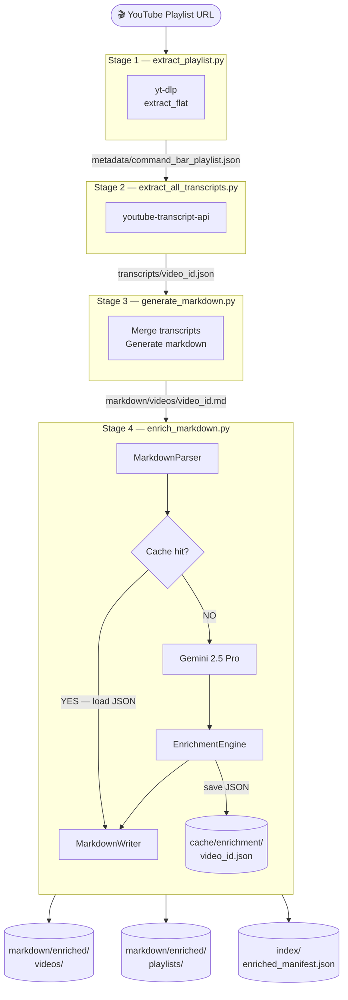

# Architecture

## Overview

youtube-rag-builder is a sequential data pipeline. Each stage is an independent Python script that reads from one directory and writes to another. Stages can be re-run independently — for example, re-running enrichment on already-generated markdown without re-downloading transcripts.

---

## Pipeline Stages

```
┌──────────────────────────────────────────────────────────────────────┐
│                         PIPELINE STAGES                              │
│                                                                      │
│  ┌─────────────┐                                                     │
│  │  YouTube    │                                                     │
│  │  Playlist   │  URL                                                │
│  │  (source)   │                                                     │
│  └──────┬──────┘                                                     │
│         │ yt-dlp                                                     │
│         ▼                                                            │
│  ┌─────────────┐                                                     │
│  │  Stage 1    │  extract_playlist.py                                │
│  │  Metadata   │──► metadata/command_bar_playlist.json               │
│  │  Extraction │                                                     │
│  └──────┬──────┘                                                     │
│         │                                                            │
│         ▼                                                            │
│  ┌─────────────┐                                                     │
│  │  Stage 2    │  extract_all_transcripts.py                         │
│  │  Transcript │──► transcripts/{video_id}.json                      │
│  │  Extraction │──► index/videos.csv                                 │
│  └──────┬──────┘──► index/videos.json                               │
│         │                                                            │
│         ▼                                                            │
│  ┌─────────────┐                                                     │
│  │  Stage 3    │  generate_markdown.py                               │
│  │  Markdown   │──► markdown/videos/{video_id}.md                   │
│  │  Generation │──► markdown/playlists/{slug}.md                    │
│  └──────┬──────┘──► markdown/index.md                               │
│         │           index/markdown_manifest.json                     │
│         ▼                                                            │
│  ┌─────────────┐                                                     │
│  │  Stage 4    │  enrich_markdown.py                                 │
│  │  AI         │──► markdown/enriched/videos/{video_id}.md           │
│  │  Enrichment │──► markdown/enriched/playlists/{slug}.md            │
│  │  (Gemini)   │──► cache/enrichment/{video_id}.json                 │
│  └─────────────┘──► index/enriched_manifest.json                    │
└──────────────────────────────────────────────────────────────────────┘
```

---

## Mermaid Diagram



---

## Component Design

### Scripts

Each script is self-contained and follows the same structural pattern:

- Path constants at the top (`ROOT`, `VIDEOS_DIR`, etc.)
- Pure functions or classes for data transformation
- A `main()` function as the entry point
- `if __name__ == "__main__": main()`

### Provider Pattern (`enrich_markdown.py`)

The enrichment script uses a provider abstraction to decouple the pipeline from any specific LLM vendor:

```
LLMProvider (abstract)
    │
    ├── GeminiProvider        ← active
    ├── ClaudeProvider        ← implemented, not wired
    ├── AzureOpenAIProvider   ← stub
    └── OpenAIProvider        ← stub
```

`build_provider()` is the single wiring point — swapping providers requires changing one function.

### Cache Layer

Enrichment responses are cached as JSON files keyed by `video_id`:

```
cache/enrichment/{video_id}.json
```

On each run, `EnrichmentEngine.enrich_video()` checks for a cache hit before calling the LLM. This prevents redundant API calls when re-running the pipeline.

### YAML Front-matter

Enriched video files include a YAML front-matter block at the top, enabling metadata-based filtering in vector databases:

```yaml
---
video_id: abc123
playlist: Power Apps - Command Bar
channel: Microsoft Power Apps
keywords:
  - command bar
technologies:
  - Power Apps
---
```

---

## Data Flow Summary

| Stage | Input | Output |
|---|---|---|
| extract_playlist | YouTube URL | `metadata/*.json` |
| extract_all_transcripts | `metadata/*.json` | `transcripts/*.json`, `index/videos.*` |
| generate_markdown | `metadata/*.json` + `transcripts/*.json` | `markdown/**` |
| enrich_markdown | `markdown/videos/*.md` | `markdown/enriched/**`, `cache/**`, `index/enriched_manifest.json` |

---

## Design Principles

- **Sequential, not coupled** — each stage reads files from disk; no in-memory passing between stages
- **Idempotent** — re-running any stage overwrites previous output safely
- **Cache-friendly** — enrichment is expensive; the cache layer makes re-runs free for already-processed videos
- **Provider-agnostic** — the enrichment engine works with any LLM via the `LLMProvider` interface
